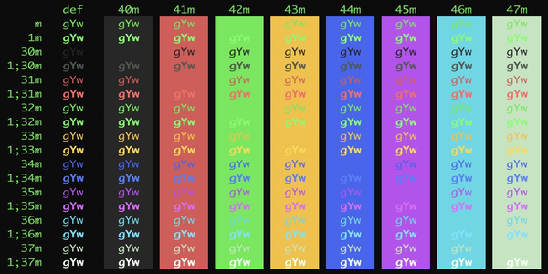

### RetroLegends

RetroLegends combines authentic phosphor colors from classic terminals to create a modern, yet historically authentic experience. Features the iconic green of the DEC VT100 (P1 phosphor), amber warnings from the Wyse 60 (P3 phosphor), and accent colors inspired by the Commodore 64, IBM 3278, Kaypro, and Osborne 1. Each color has been carefully tuned for both authenticity and readability.
